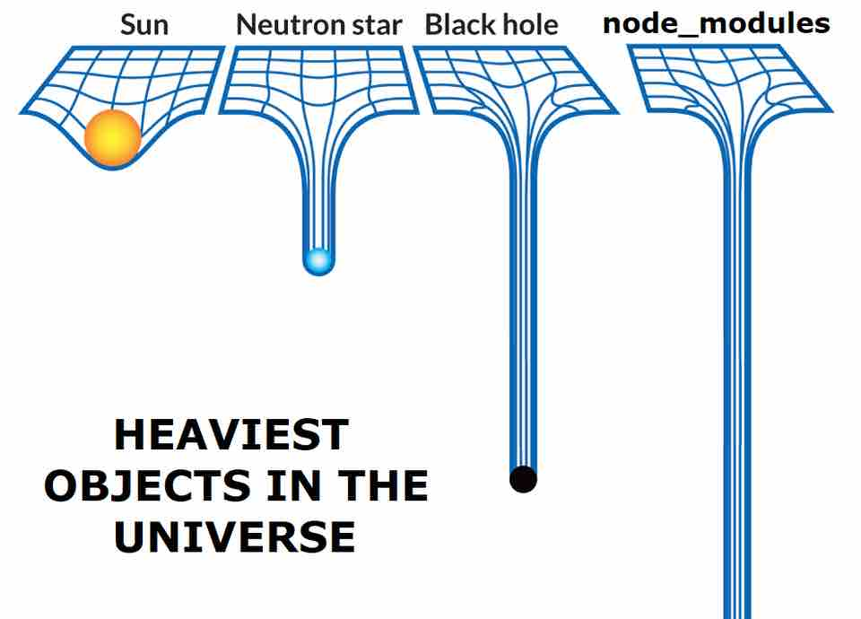

# node_modules-disk-image

This is a macOS-only tool that creates a disk image to put `node_modules` in.

This makes it so that when the disk image is not mounted, it is treated as a
single file by apps, resulting in these benefits:

- Spotlight won't go crazy indexing the contents in the background, and your
  Spotlight search results won't be cluttered with tens of thousands of
  irrelevant files from `node_modules`.
- Disk management tools will be able to calculate the "folder" size instantly.
- Deleting, copying, or backing up the folder won't incur a painful overhead.

## Usage

**To install:**\
Clone this repo and add `bin/` to `$PATH`.

**To set up for a repo:**\
Run `nmg init` to create the `node_modules` disk image. Then, if you have an existing
`node_modules` folder, run `nmg migrate` to move it over to this new system.

**Now everything is set up!**\
Run `nmg mount` to mount the disk image, and `nmg unmount` to unmount it.
